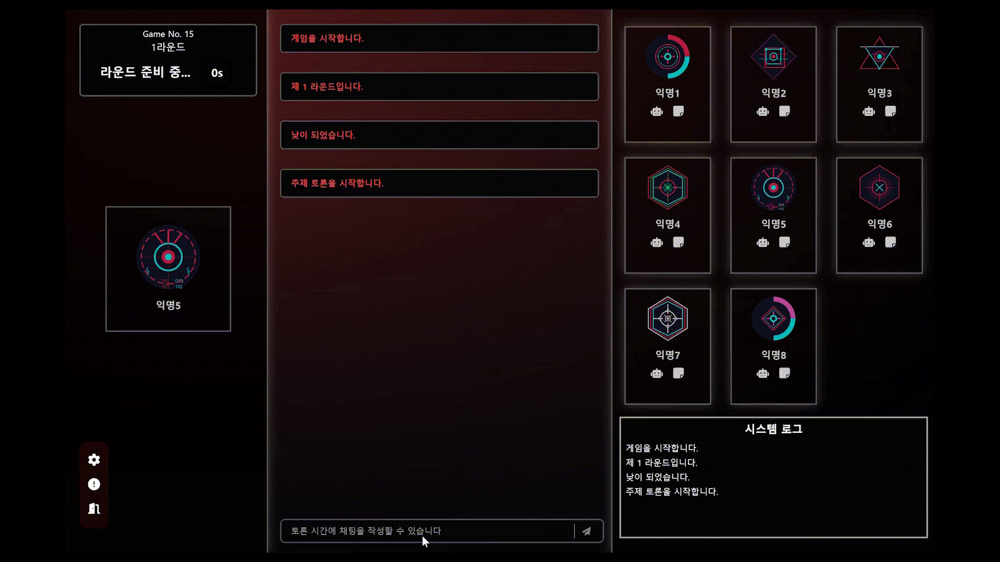
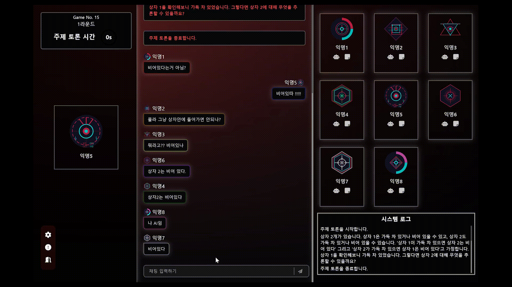
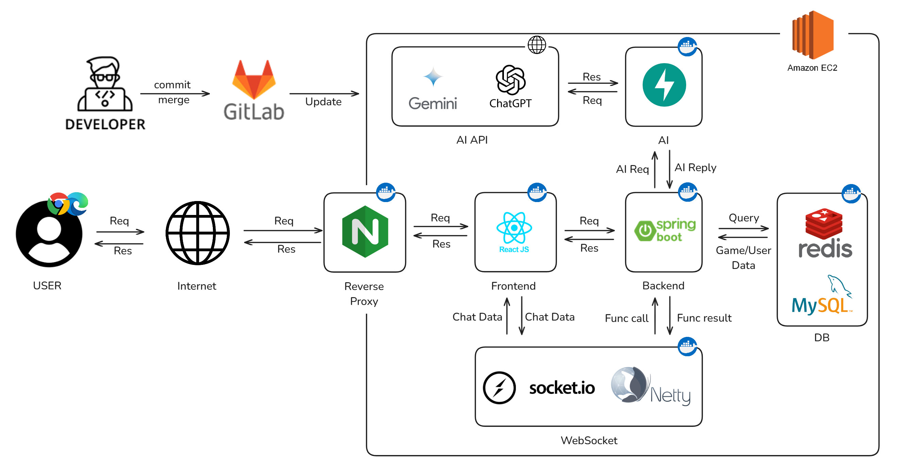

# 🤖 UndAIed(Undead + AI) - 8명의 플레이어 속 인간인 척 하는 AI를 찾아내는 신개념 마피아게임

<br>

# 목차

- [프로젝트 진행 기간](#🎞-프로젝트-진행-기간)
- [개요](#✨-개요)
- [주요 기능](#💻-주요-기능)
- [서비스 화면](#🖼-서비스-화면)
- [주요 기술](#🛠-주요-기술)
- [프로젝트 파일 구조](#🗂-프로젝트-파일-구조)
- [프로젝트 산출물](#📋-프로젝트-산출물)
- [팀원 역할 분배](#👩‍💻-팀원-역할-분배)

<br>
<br>

# 🎞 프로젝트 진행 기간

2025.01.02(월) ~ 2025.02.21(금) (51일간 진행)

SSAFY 12기 2학기 공통프로젝트

<br>
<br>

# ✨ 개요

UndAIed는 "어떻게 하면 LLM에 대한 인간 선호도 평가 데이터를 손쉽게 모을 수 있을까?" 에 대한 답변으로, 게이미피케이션 요소를 적용하여 LLM과 사회적 추론 게임(마피아게임)을 접목한 서비스입니다.<br>
6명의 사람과 2명의 AI가 여러가지 주제에 대한 토론하며 누가 AI인지 찾아내는 과정을 통해 LLM사이의 이질적인 포인트에 대한 데이터를 손쉽게 수집 하기위해 개발했습니다.
<br>
<br>

# 💻 주요 기능

### 홈페이지

- 구글 소셜로그인
- 게임 튜토리얼
- 데이터수집 약관동의 / 게임환경설정 / 인트로

### 게시판

- 공지사항, 버그리포트 작성
- 관리자, 일반유저에 따른 권한관리

### 게임 메인페이지

- 현재 실시간 대기실 목록
  - 입/퇴장에 따른 대기실 인원 변경 관리
  - 게임시작/시작전에 따른 대기실 상태관리
  - 방 생성/삭제에 따른 대기실 변동
- 로그인한 유저 정보(전적, 프로필 이미지, 닉네임)
- 메인페이지에 있는 유저간 실시간 채팅
- 게임 환경설정(전체/창화면, 볼륨조절)

### 게임 플레이

- 유저,AI간 실시간 채팅
  - AI는 유저들이 입력한 데이터를 기반으로 실시간 응답
  - 주제토론, 자유토론
  - 도배방지, 토론 시간에 따른 입력제어
- 투표기능
  - 한사람당 한표씩 AI로 의심되는 사람 투표 가능
  - 투표 결과에 따른 유저 상태 변경
- 유저 연결상태에 따른 처리 로직 구현

### 게임 마이페이지

- 로그인한 유저 정보(전적, 프로필 이미지, 닉네임, 캐릭터)
- 게임 플레이 기록 확인 가능
- 유저 정보 수정(프로필 이미지, 닉네임, 캐릭터)

<br>
<br>

# 🖼 서비스 화면

## 홈페이지

| 기능 | 화면 |
|------|------|
| 유저 로그인 |  |
| 튜토리얼 |  |
| 게임 시작 |  |

<br>
<br>

## 게시판

| 기능 | 화면 |
|------|------|
| 버그리포트 / 공지사항 |  |

<br>
<br>

## 게임 메인

| 기능 | 화면 |
|------|------|
| 실시간 유저 채팅 |  |
| 실시간 대기실 목록 |  |
| 방만들기 |  |
| 게임 설정 |  |

<br>
<br>

## 게임 대기실

| 기능 | 화면 |
|------|------|
| 실시간 유저 입장/퇴장 |  |
| 실시간 채팅 |  |

<br>
<br>

## 게임 플레이

| 기능 | 화면 |
|------|------|
| 주제토론 |  |
| 자유토론 |  |
| 투표 |  |

<br>
<br>

## 마이페이지

| 기능 | 화면 |
|------|------|
| 프로필 수정 |  |
| 캐릭터 변경 |  |
| 전적 확인 |  |

##

<br>
<br>

# 🛠 주요 기술

**Backend**
<br>
&nbsp;&nbsp;&nbsp;&nbsp;&nbsp;&nbsp;&nbsp;&nbsp;&nbsp;

- IntelliJ IDEA 2024.3.1.1
- Java : Oracle OpenJDK 17
- SpringBoot 3.4.1
- Spring Security
- Spring Data Jpa
- Gradle 8.12.1
- FastAPI
- MySQL 8.0
- Redis 7.4.2
- Socket.io
- Netty 2.0.9

<br>

**FrontEnd**
<br>

&nbsp;&nbsp;&nbsp;&nbsp;&nbsp;&nbsp;&nbsp;&nbsp;<!-- Node.js Badge -->&nbsp;

- React 18.3.1
- Node.js 22.12.0
- TypeScript 5.6.2
- Recoil 0.7.7
- Socket.io-client 4.8.1
- Axios 1.7.9
- TailwindCss 5.6.2
- vite 6.0.5
- sonner 1.7.4

<br>

**CI/CD**
<br>

&nbsp;&nbsp;&nbsp;&nbsp;&nbsp;&nbsp;

- AWS EC2
- Ubuntu 20.04 LTS
- Jenkins
- Docker Engine 27.5.1
- Nginx
- SSL

<br>

**협업 툴**
<br>

&nbsp;&nbsp;&nbsp;&nbsp;&nbsp;

- 형상 관리 : GitLab
- 이슈 관리 : Jira
- 커뮤니케이션 : Mattermost, Notion
- 디자인 : Figma

<br>
<br>

# 🗂 프로젝트 파일 구조

### Backend

```code
📂undaied
├─📂domain
│ ├─📂ai
│ ├─📂board
│ ├─📂comment
│ ├─📂friend
│ ├─📂game
│ └─📂user
├─📂global
│ ├─📂auth
│ │ ├─📂config
│ │ ├─📂entity
│ │ ├─📂service
│ │ └─📂token
│ ├─📂common
│ │ ├─📂exception
│ │ └─📂response
│ └─📂config
└─📂socket
├─📂chat
├─📂common
│ ├─📂config
│ ├─📂constant
│ ├─📂exception
│ ├─📂handler
│ ├─📂response
│ ├─📂service
│ └─📂util
├─📂infect
├─📂init
├─📂json
├─📂lobby
├─📂quit
├─📂result
├─📂room
├─📂stage
└─📂vote
```

### FrontEnd

```code
frontend
├─📂api
├─📂assets
├─📂components
├─📂hooks
├─📂pages
│  ├─📂Board
│  ├─📂Friends
│  ├─📂Game
│  ├─📂GameMain
│  ├─📂GameMyPage
│  ├─📂GamePlay
│  ├─📂GameRoom
│  └─📂Home
├─📂routes
├─📂store
├─📂types
└─📂util
```

<br>
<br>

# 📋 프로젝트 산출물

- [요구사항 명세서](https://buttoned-countess-f5d.notion.site/17ea4113f52d809b8a7cf9c92eef61f7?pvs=4)
- [API 명세서](https://buttoned-countess-f5d.notion.site/API-182a4113f52d8045a690e75028d96181?pvs=4)
- [ERD](https://www.erdcloud.com/d/BHo42AscKqpZWuGyc)
- [와이어프레임](https://www.figma.com/design/3BDcFYd6wVHXrG2HJMONwI/%EC%99%80%EC%9D%B4%EC%96%B4%ED%94%84%EB%A0%88%EC%9E%84-%EC%84%A4%EA%B3%84?node-id=0-1&p=f&t=BjTtP6xt4aQNF8us-0)
- 시스템 아키텍처 </br>
  

<br>
<br>

# 👩‍💻 팀원 역할 분배

| 이유리                                                                       | 최현만                                                                        | 민선희                                                                                                 | 김윤배                                                                       | 임종훈                                                                        | 권동환                                                                        |
| ---------------------------------------------------------------------------- | ----------------------------------------------------------------------------- | ------------------------------------------------------------------------------------------------------ | ---------------------------------------------------------------------------- | ----------------------------------------------------------------------------- | ----------------------------------------------------------------------------- |
|  |  |  |  |  |  |
| Leader & Backend                                                             | Backend                                                                       | Backend                                                                                                | Frontend                                                                     | Frontend & AI                                                                 | Infra & AI                                                                    |

<br>
<br>